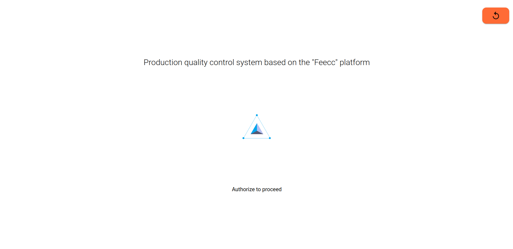
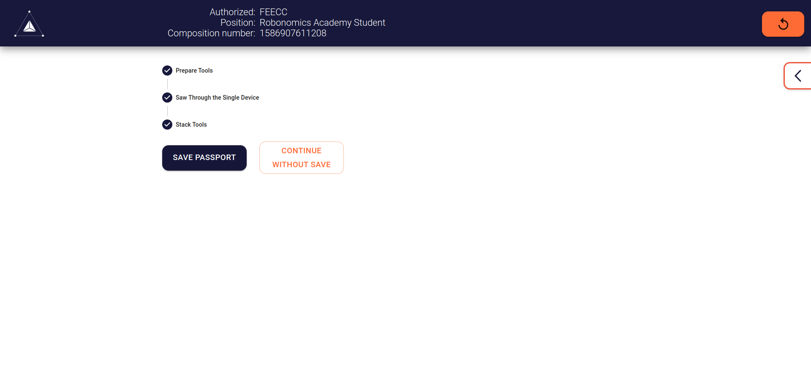
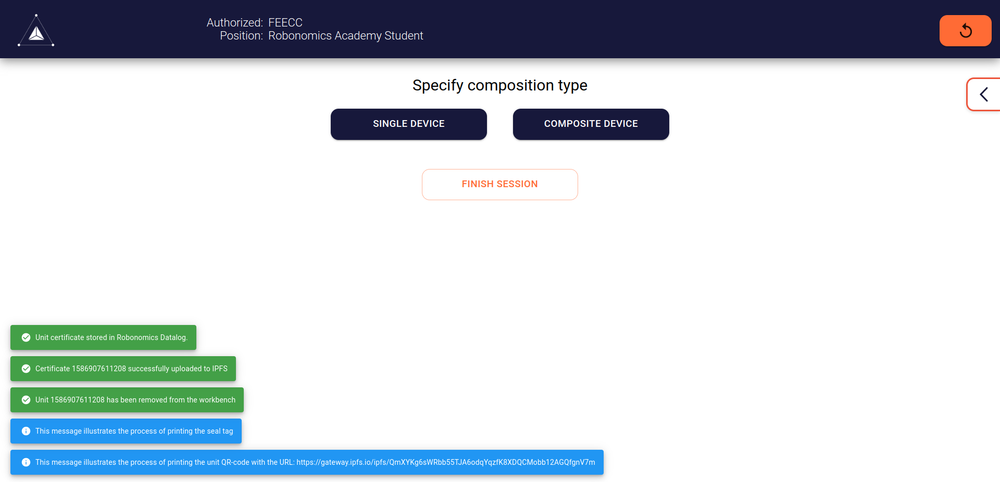
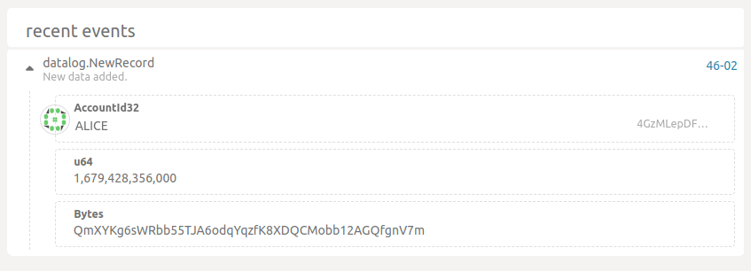
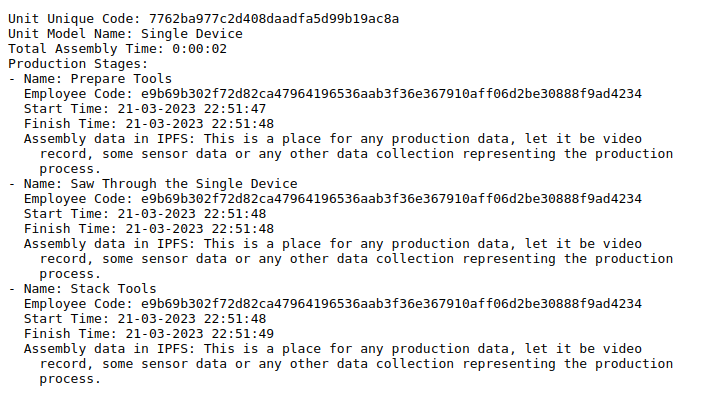

# FEECC Academy Demo

>This is a virtual stand representing a real-life instance of a FEECC production tracking system. For the purposes of
demonstration it lacks some features like label printing or video recording, but it holds the main concept of such a
system - **transparent production tracking with Web3-proved safety**

## List of used technologies
- [Robonomics](https://robonomics.network)
- [IPFS](https://ipfs.tech/)
- [Flask](https://flask.palletsprojects.com/en/2.2.x/)
- [MongoDB](https://www.mongodb.com/)


## Core concept
> More info about this system may be found [here](https://multi-agent.io/projects/feecc/).

1. The system contains some production schemas stored in a local DB
2. The employee authorizes into the system with their RFID card *(Omitted here in favor of HID emulator)*
3. They then can select an item to assemble
4. The entire process is guided and tracked e.g. with a video camera *(Omitted here in favor of user confidentiality)*
5. The production data is saved in a decentralized file storage *(Here, a local IPFS node is used)*
6. The IPFS CID of  unit certificate is securely stored in Robonomics blockchain. *Here, local instance of Robonomics Node used*

## Prerequisites
- UNIX-like system (tested fine on [Ubuntu 22.04](https://releases.ubuntu.com/jammy/))
- [Docker](https://docs.docker.com/engine/install/ubuntu/) and [Docker compose](https://docs.docker.com/compose/)
- Web browser (tested fine on Google Chrome and Mozilla Firefox)

## Install
```bash
git clone https://github.com/Multi-Agent-io/feecc-academy
cd feecc-academy
docker compose up -d --build
```

> It may happen that you already have an IPFS instance or Robonomics Node running on your PC. With that occured, 
> some containers (`ipfsnode` and `robonomics`) will fail to start, skip it

To validate containers running use 
```bash
docker ps -a
```

You should see the following (`ipfs` has exited here, since there is a native instance already running)
```log
CONTAINER ID   IMAGE                               COMMAND                  CREATED          STATUS                             PORTS     NAMES
0db8382bb271   feecc-academy-workbench-daemon      "uvicorn app:app --h…"   19 seconds ago   Up 7 seconds (healthy)                       feecc_academy_workbench_daemon
0dbc7bb977d1   feecc-academy-workbench-frontend    "node nodeServer.js"     20 seconds ago   Up 19 seconds (health: starting)             feecc_academy_workbench_frontend
a74fa229eb90   robonomics/robonomics:sha-bd71a23   "robonomics --dev --…"   20 seconds ago   Up 19 seconds (health: starting)             feecc_academy_robonomics_node
0c9e8022658a   mongo:jammy                         "docker-entrypoint.s…"   20 seconds ago   Up 19 seconds (healthy)                      feecc_academy_mongoDB
6b0748904d0f   ipfs/go-ipfs:v0.17.0                "/sbin/tini -- /usr/…"   20 seconds ago   Up 19 seconds (healthy)                      feecc_academy_ipfsnode
814e6f489a77   nyurik/alpine-python3-requests      "tail -f /dev/null"      20 seconds ago   Up 19 seconds                                feecc_academy_hid_emulator
```

## Run
Navigate to [localhost:3000](http://localhost:3000), there you will see a welcome screen.



In a real factory this requires an employee to put their RFID card on a scanner, since you don't have any, there is a 
workaround called `hid-emulator.py`. It is available in a separate Docker container:

```bash
docker exec -ti feecc_academy_hid_emulator sh
python3 hid-emulator.py
```

It has two emulated functions: **put an RFID card** and **scan a barcode**. Here, RFID needed, so input `1`, this will
authorize you in a system.

```bash
> Select emulated action (1/2): 
>  1. Put ID card on the RFID scanner.
>  2. Scan a sample barcode with a barcode scanner.
> 1
> INFO:2023-03-21 21:42:05,370:Event relayed to endpoint http://127.0.0.1:5000/workbench/hid-event
> Select emulated action (1/2): 
>  1. Put ID card on the RFID scanner.
>  2. Scan a sample barcode with a barcode scanner.

```


Here, two schemas are available, let's start with a `Single Device`


The blue message at the bottom acts like a printer, in real conditions, a label with a barcode is printed. Right now
the unit number is not important, you can pass through sample production stages which are to be tracked and recorded if
needed. Here there are just dummy strings in a certificate.



Before clicking `Save passport`, navigate to a 
[local Robonomics Node](https://polkadot.js.org/apps/?rpc=ws%3A%2F%2F127.0.0.1%3A9944#/explorer), you will need it later.

Back in the FEECC interface, click `Save Passport` button.




What happens here is the certificate is uploaded to IPFS along with some tracked data and the CID is stored in Robonomics
Network, you may see it in the extrinsics list or recent events.



Once again, the blue messages illustrates printing the seal tag and QR-code leading to the certificate. 
The QR-code contains a link to an IPFS gateway with the device certificate. Since your local IPFS node may not have that
discoverability, you may reach the file locally with `localhost:8080/ipfs/<cid>`, but in real life this file is accessible
world-wide. The company may then give access to this QR-code to its customers to raise trust level and increase transparency.
Another way is to use this certificates in TCD.



That's so, this system is designed to track production data and securely store in with the help of Web3 technologies.
Here, some steps are omitted or simulated in favor of giving you the experience of future production worker, but in real
life this system uses various peripheral devices to collect and share data.

## Composite devices

It is possible to assemble a composite device, you first need to assemble a `Composite Device -> Sample Device` **(save its unit number)** 
which is a part of a bigger one and then click `Composite Device -> Final Assembly`, "scan" the unit id ith a `hid-emulator` 
(use previously saved unit number) and assemble the final device. 

All the unit data is accessible locally in a unit-passports folder.

## Pause

May you wish to stop the containers for a while, use
```bash
docker compose stop
```
To resume the containers, use
```bash
docker compose start
```

## Uninstall

```bash
docker compose down --rmi all && docker builder prune -f
```
